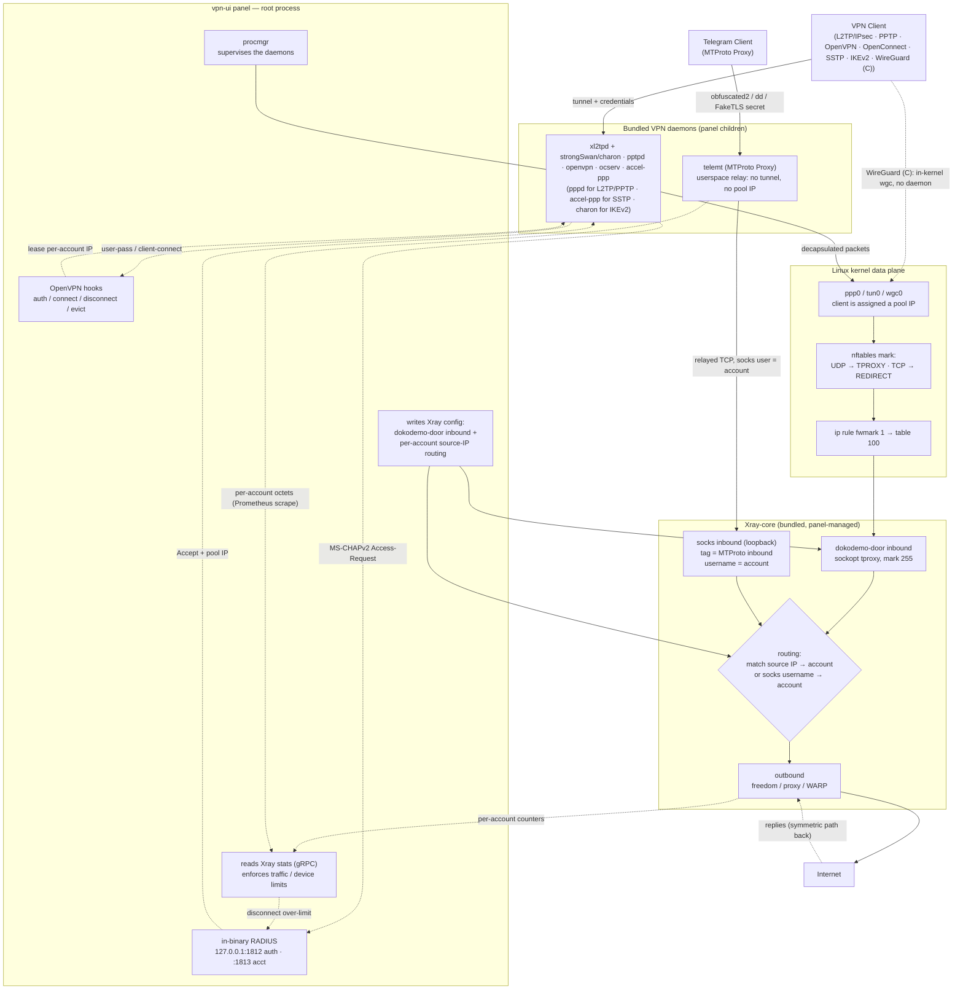
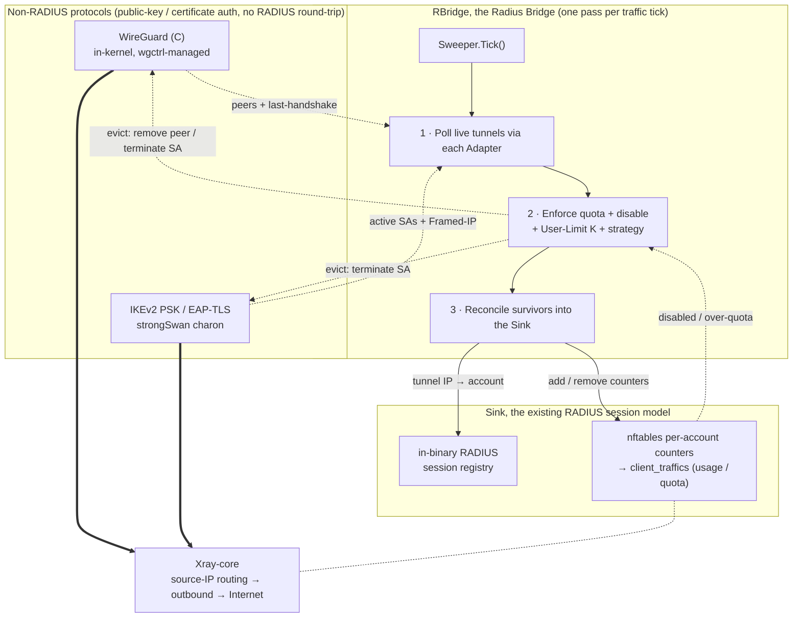

[English](/README.md) | [فارسی](/README_FA.md) | [العربية](/README_AR.md) | [中文](/README_ZH.md) | [Español](/README_ES.md) | [Русский](/README_RU.md) | [Türkçe](/README_TR.md)

<p align="center">
  
</p>

این پروژه، یک نسخه‌ی ارتقایافته از پنل **[3X-UI](https://github.com/MHSanaei/3x-ui)** (نسخه‌ی 2.9.3) هستش.  هدف این پروژه اضافه کردن پروتکل های مختلف و راه اندازی بصورت یک پنل جامعه با پشتیبانی از قابلیت های **Xray-core**  هستش

## پروتکل‌های جدید

- PPTP
- L2TP (RAW)
- L2TP/IPsec
- OpenVPN
- OpenConnect (cisco)
- SSTP
- IKEv2
- WireGuard (C)
- MTProto Proxy (Telegram)

## امکانات جدید

- قابلیت **Client to Client** حتی بصورت **Cross Inbound** (اتصال داخلی کاربر L2TP به کاربر OpenVPN)
- اضافه‌شدن **Encryption** های **AES-256-GCM** و **AES-128-GCM** به پروتکل **Shadowsocks**
- پشتیبانی از **XHTTP Object** در **Outbound**
- اسکریپت نصب خودکار **[WARP-CLI](https://github.com/Sir-MmD/warp-cli)** (نسخه‌ی رسمی Cloudflare)
- هسته‌ی [**Xray-core** پچ‌شده](https://github.com/Sir-MmD/Xray-core) برای رفع خطای «Unsupported Cipher» در پروتکل **Shadowsocks**
- باندل‌شدن همه‌ی فایل‌ها (Geofile، Xray-core و هسته‌های Backend) داخل یک فایل باینریِ واحد
- خروجی گرفتن لینک اکانت ها بصورت **TXT** و **PDF**
- قابلیت **Freez** کردن اکانت هات
- اضافه شدن **checkbox** به کلاینت و Inbound ها
- قابلیت **Bulk Operation**: 

    * تغییر گروهی حجم اکانت ها
    * تغییر گروهی روز اکانت ها
    * فعال سازی/غیر فعال سازی گروهی اکانت ها
    * حذف گروهی اکانت ها
    * حذف گروهی Inbound ها
    * قابلیت Freez/Un-Freez کردن گروهی اکانت ها

## سیستم‌عامل‌های تست شده


| | Distribution |Version |Version |Version |
|:---:|:---|:---:|:---:|:---:|
|  | **Ubuntu** | `22.04` | `24.04` | `26.04` |
|  | **Debian** | `12` | `13` | |
|  | **Fedora** | `43` | `44` | |
|  | **AlmaLinux** | `9` | `10` | |
|  | **Rocky Linux** | `9` | `10` | |
|  | **Arch Linux** | `Rolling` | | |


> [!IMPORTANT]
> پیشنهاد می‌شه حتماً پنل رو روی سیستم‌عامل‌های تست‌شده نصب کنید؛ چون احتمال این‌که هسته‌های جدید روی بقیه‌ی سیستم‌عامل‌ها درست کار نکنن بالاست!

## نصب پنل

```bash
curl -Ls https://raw.githubusercontent.com/Sir-MmD/vpn-ui/refs/heads/main/deploy.sh | sudo bash
```

## حذف پنل

```bash
sudo /opt/vpn-ui/vpn-ui-amd64 --uninstall
```

> [!NOTE]
> مسیر دیتابیس، سرویس systemd و همه‌ی پورت‌های پیش‌فرض تغییر کرده‌اند، پس می‌تونید این پنل رو بدون هیچ مشکلی کنار پنل‌های دیگه‌تون نصب کنید.

## اسکرین‌شات‌ها


## نحوه‌ی تعامل پروتکل‌های جدید با هسته‌ی Xray-core



## نحوه‌ی کار RBridge با پروتکل‌های بدون RADIUS




## کامپایل از سورس

```bash
git clone https://github.com/Sir-MmD/vpn-ui.git && cd vpn-ui
./build.sh
```

## تست E2E


یک تست **E2E** کامل با Python داخل فولدر `test_unit` برای این پروژه طراحی شده که می‌تونید ازش استفاده کنید. مراحلش این‌طوریه:

1. وارد فولدر `test_unit` بشید و تنظیمات دلخواه‌تون رو توی `config.toml` وارد کنید.
2. اسکریپت `setup.sh` رو اجرا کنید.
3. فایل باینریِ کامپایل‌شده رو داخل فولدر `test_subject` قرار بدید.
4. `run.sh` رو با دسترسی `sudo` اجرا کنید.

> [!IMPORTANT]
> تست کامل E2E به‌شدت زمان‌بره؛ اگه فقط یه تغییر کوچیک توی پروژه دادید، بهتره با سویچ `--tests` فقط همون بخش رو تست کنید:

| Test ID | Description |
| :--- | :--- |
| `core-init` | provision kernel modules + packages + xray core |
| `server-setup` | create inbounds + accounts + source-IP routing rules |
| `openvpn` | connect variants + checks + peer reachability (OpenVPN) |
| `l2tp` | connect variants + checks + peer reachability (L2TP/IPsec) |
| `pptp` | connect variants + checks + peer reachability (PPTP) |
| `openconnect` | connect variants + checks + peer reachability + same-NAT user-limit (OpenConnect/ocserv) |
| `sstp` | connect variants + checks + peer reachability (SSTP/accel-ppp, PPP-over-TLS) |
| `ikev2` | connect + checks + peer reachability (IKEv2/IPsec, strongSwan charon; eap-mschapv2 + psk + eap-tls) |
| `wg-c` | connect + checks + peer reachability + per-account usage/termination (WireGuard C, in-kernel wgctrl, gateway /29, + preshared-key mode) |
| `mtproto` | alias: runs every MTProto phase below (MTProto Proxy, telemt) |
| `mtproto-classic` | handshake + relay to a real Telegram DC + wrong-secret control + usage (obfuscated2) |
| `mtproto-secure` | same, "dd" random-padding secret |
| `mtproto-tls` | same + FakeTLS ServerHello HMAC verified, "ee" secret |
| `mtproto-toggle` | editing an account's modes takes effect on the RUNNING daemon (no restart) |
| `bulk-ops` | bulk client add/sub/enable/disable + TXT/PDF export via API |
| `backup-restore` | DB export + import round-trip |
| `warp-socks` | Cloudflare warp-cli SOCKS install + egress |
| `random-cfg` | `--random` switch: randomize port + creds + webpath, then restore |
| `systemd` | `--systemd` switch: install + run the panel as a systemd unit |
| `uninstall` | `--uninstall` switch: install everything, tear down, assert clean host |
| `export-js` | host-side Node TXT/PDF export test (no VM) |

برای تست روی فقط یک سیستم‌عامل خاص هم می‌تونید از سویچ `--only` استفاده کنید:

```bash
sudo ./run.sh --only ubuntu-24
```

## دونیت

🔹USDC-Polygon: ```0xdC2Ab962954e8fA1502C44656c5A32CF2979568C```

🔹USDT-BEP20: ```0xdC2Ab962954e8fA1502C44656c5A32CF2979568C```

🔹USDT-TRC20: ```TXEhckDXtdLGAjP5PZXfNnQjPHzEVTcBmR```

🔹TRX: ```TXEhckDXtdLGAjP5PZXfNnQjPHzEVTcBmR```

🔹LTC: ```ltc1qmapmnuf6cq9x679nmu0k4uyq779mxxcwnkgdll```

🔹BTC: ```bc1q62w7lyndzndsp74vj4dsayvun8xnapzq6hx5ea```

🔹ETH: ```0xdC2Ab962954e8fA1502C44656c5A32CF2979568C```
